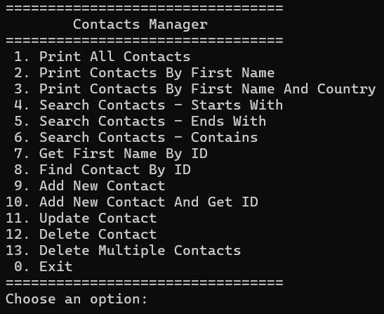

# ContactsManager

This project manages contacts through the core database operations (CRUD): Create, Read, Update, and Delete.

## Features

- Add a new contact, with the option to retrieve its auto-generated ID upon insertion
- Display all stored contacts
- Search contacts in multiple ways: by first name, by first name and country, or partial match (starts with / ends with / contains)
- Update an existing contact's information
- Delete a single contact or multiple contacts at once
- Interactive menu interface for easy navigation between all operations

## Technologies Used

- **C#**
- **ADO.NET**
- **SQL Server**

## Screenshot of the Main Menu

The program's main menu, where the user selects the desired operation from 13 available options:

## How to Run

1. Clone the repository to your machine
2. Open the solution file (`.slnx` or `.sln`) in Visual Studio
3. Run the database script located at `Database/ContactsDB.sql` using SQL Server Management Studio (SSMS) to create the `ContactsDB` database and its tables
4. Create an `App.config` file in the project (not included by default for security reasons) and add your own connection string
5. Run the project (F5) in Visual Studio